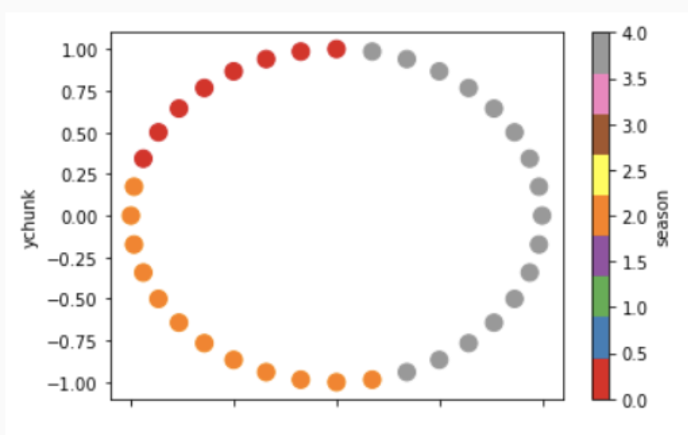
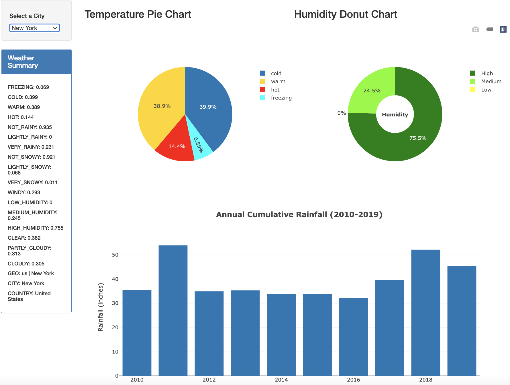

# Weather_Data_Analysis
### [Dashboard](https://lilyhanhub.github.io/Weather_Data_Analysis/) || [source code](https://github.com/lilyhanhub/Weather_Data_Analysis/tree/main/Visualization)
### [Flask Website Deployed on Heroku](https://funwithweather.herokuapp.com/) || [source code](https://github.com/lilyhanhub/Weather_Data_Analysis/tree/main/Alice_Deployed)
### [Data Cleaning and Machine Learning source code](https://github.com/lilyhanhub/Weather_Data_Analysis/tree/main/Data_Cleaning_and_Machine_Learning)
### [Presentation](https://docs.google.com/presentation/d/18-VEJ8IIayyh4h5R4JsaiAnWNHR6Se58ke8NIy-_sis/edit#slide=id.g16a663a645d_1_11)

## Project Overview
The purpose of this project is to analyze the past weather data for a given location within a given range of dates-of-the-year (e.g. London, UK averaged 5 rainy days between March 25 and April 3 in the past 17 years) to predict the weather of that location. The interactive dashboard presents analysis of the weather data, including temperature, rainfall, snowllfall, windspeed, humidity, and cloudiness. So a front-end user could access our website and utilize the tool to retrieve instant and informative weather information about a given location for trip planning. 

## Motivation & Questions to Answer
### Motivation
Weather is an interesting and data-rich subject that naturally lends itself to this course. We have already seen how .json files packed with interesting data can be obtained freely from api calls made available from sites like openweather and deployed in visually compelling styles with google maps. 

More broadly, however, who doesn’t think weather is interesting? Weather is everywhere, all the time. It is among the most common conversational topics worldwide. Weather influences our daily activities, our travel destination choices, even our emotional state. Weather is dramatic, violent, occasionally very dangerous and, more now than perhaps at any other time in human history, of critical importance to the planet.

Thinking more specifically about travel destination choices or trip planning with respect to weather, our project will attempt to create a tool that provides a front-end user with weather information for a destination that they specify based on historical weather data obtained from our API call. This feature should be interesting for not only members of our class but for the general public. A hypothetical front-end user from the public should theoretically be able to access and utilize our tool to retrieve real, informative weather information about a given location. Such a tool has real value.

### Questions to Answer
This project will try to answer at least some of the following questions:

* Is it still feasible to replicate or approximate the old Trip Planner feature from Weather Underground? Trip Planner was an interactive, user-inputted function that returned weather-related information to a front-end user based on certain criteria that was of interest. One of our questions is to determine whether this type of feature can be recreated or approximated.

* Can a machine learning model adequately categorize and cluster, and then return to a front-end user correct or generally realistic weather conditions for a specific season and/or location? A key question of this project is to determine whether a machine-learning tool can return accurate/realistic weather-related information to a user based on location and (perhaps) time of year inputs the user provides. A sensitive and precise machine learning program returning weather-related predictions would be very interesting and potentially very powerful.

---
---

## Data Sets/ Data Tools Used
* [Data Source: Historical Weather API](https://open-meteo.com/en/docs/historical-weather-api)
* Language: 
    * Python, Flask, Machine Learning
        * Dependecies: pandas, numpy, datetime, scikit-learn, hvplot
    * JavaScript, HTML, CSS
        * Libraries: Bootstrap, D3, plotly
* Software: Jupyter Notebook, VSCode, Heroku
---
---

## Database
Data elements eventually used for Machine Learning model, step by step:
- Starting with user input for geographical area, pulling in Latitude/Longitude to be fed to the weather API. Tested several free API options.
    - N/A: Tried using https://api-ninjas.com/api/geocoding but it was too unreliable.
    - N/A: Tried Google AWS geocoding, but it was more complicated than we needed.
    - Settled on https://positionstack.com and eventually got that working. Free for several thousand pulls/month.
        - Input, from web site user: “query” field = “Specify your query as a free-text address, place name or using any other common text-based location identifier (e.g. postal code, city name, region name).”
        - Output to be fed to weather API: Tuple containing Latitude and Longitude for one geographic location.
- Weather API:
    - Input: Latitude and Longitude for one geographic location, extracted from API based on user input.
    - Output: Selected weather data points from Historical Weather API (https://open-meteo.com/en/docs/historical-weather-api) based on Latitude and Longitude.
    
    - Output categories created from the cleaned API data, to be fed into the Machine Learning models. Some can be used as direct averages or sums, others will be transformed into “pivot table” formats of several sub-categories for the levels of intensity. (For example: Raininess levels by day: “No Rain”/”Light Rain”/”Heavy Rain” where each column contains 1 or 0 for True/False.)
        - Temperature levels by day
        - Humidity levels by day
        - Raininess levels by day
        - Snow levels by day
        - Cloudiness level by day
        - Windiness level by day
---
---
## Machine Learning Model
We hope to accomplish at least one of two machine learning tasks:

- Task 1. Identifying seasons with (unsupervised) k-means clustering.

	- The four traditional euro-centric seasons (winter, spring, summer, autumn) are not meaningful in much of the world, especially near the equator. Instead, there might be rainy and dry seasons; or seasons characterized by wind; or some other combination. We hope to develop a machine learning model that, given historical weather data for a fixed location, produces meaningful seasons for that location: chunks of the year with distinct weather patterns. Ideally, the model will be sufficiently robust to work with no human tweaking: in goes weather data, out come date ranges and weather-related adjectives, like "mid-november to mid-march is the cold-rainy season in San Francisco".

	- We will only work with one basic model, k-means clustering; but we shall experiment with many options for the data we feed into it. Most of these options involve very high-dimensional data, so we will use principal component analysis to lower the dimensionality. The current approach is to label each day in the historical record, and then use mode aggregation to label each day of the year.

    - Very general.

        - One model, or one model per year? Instead of training one model on data from many years, we might train a model on data from each year in the historical record, and compare results - not sure how to "compare results" without human oversight.
        - Variation within/between periods. An entirely separate approach is to compare variation within a period to variation between periods, to identify seasonal features as compared to random noise features. "Within period" means the difference between different days in the historical record that fall on the same day of the year, or the same week of the year.
        - Maybe we should be labeling weeks, not days? One option is to have each data row correspond to a week (either a week in the historical record, or one of the 52 weeks of the year). Another option is to label days in the historical record, but then aggregate labels to weeks.

    - Raw data.

        - Pivot on year? Rows might be distinct days in the historical record, or days in the year. In the second case, we'll have only 365 rows (and we'll throw away data for February 29 in leap years to preserve data symmetry), but a whole lot of columns.
        - Only daily data? Maybe the hourly data is too much, and we just want the daily statistics: max/min temperature, amounts of rain and snow, and hours of precipitation provided directly by the API; wind speed, humidity, and pressure obtained as the average of hourly values provided by the API; and something derived from the hourly percent cloudcover provided by the API. If we take few enough of these, maybe we don't need PCA.
        - Days on a circle? The key day-of-the-year variable can be stored as an integer, introducing an artificial cut between day 365 and day 1; or as a pair of coordinates on a circle.

    - Processing and modeling.

        - Which rescalers? The current model uses rescalers that make sense to Alice. We should at least try standard (minmax, or normal-esque) rescalers. 
        - Obvious hyper-parameters: the number of principal components we feed into the k-means algorithm, the number of clusters.
        - Remove outliers? We may want to remove outliers at various steps: before PCA; between PCA and k-means; or even after k-means, defining outliers as tiny clusters.
        - Smooth the output. We may want to smooth out the data along the day-of-the-year axis in some way, to get clusters that are more convex/connected. Maybe we add the data for a few adjacent days to the weather data for a fixed day before feeding it all into PCA. Maybe after labeling days in the historical record, we pay attention to adjacent days when aggregating to get a label for the day of the year. Maybe a date interval with a great variety of labels becomes a "weather varies greatly" season - that's a real thing, afterall.
   

- Task 2. Labeling months.

	- Consider a traveler who lives in Boston and is heading to Timbuktu in mid-June. If statistics and probabilities don't make sense to them, a comparison to Boston weather at various times of the year could be helpful. We hope to develop a machine learning model that will train on Boston weather data, and then label days in Timbuktu with Boston-months, according to weather. Maybe mid-June in Timbuktu is most like August in Boston. Again, the hope is for the whole thing to run on user-provided locations with no human interventions.
	- We plan to try several of the many supervised, discrete-labeling machine learning models: neural networks, ensembles, random forests; or maybe a simple logistic regression will be good enough?
	- We expect insights from data-wrangling for Task 1 to inform our choice of data to feed to these models.
	- One challenge expected here is in evaluating success: when the model mislabels months because they really have the same weather in the given location, it's not a problem, and is not fixable.

---
---

## Dashboard
Our interactive front-end/dashboard features a drop-down list of 8 cities. A user can select from the 8 options to produce a comprehensive dashboard of weather information that automatically adjusts itself based on their selection. In addition to the drop-down list, our dashboard includes the following features:

- Weather Summary Panel: 
The weather summary panel includes a percentage breakdown of temperature by category (freezing, cold, warm, hot), a percentage breakdown of raininess (not rainy, lightly rainy, very rainy), of snowiness (not snowy, lighly snowy, very snowy), humidity (low, medium and high humidity), and cloudiness (clear, partly, cloudy, or cloudy). Finally, the summary panel displays the "geo" location of the selection. In the screenshow below, you can see the geo location is the US | New York.

- Temperature Pie Chart: 
Our temperature pie chart graphically displays the percentage breakdown of temperature by the categories provided in the Weather Summary Panel. The categories are color-coded to "match" the term they describe. Thus, hot is colored in red. Warm is colored in orange. Cold is colored in blue, and freezing is colored in a light blue reminiscent of ice and iciness. Hovering over the pie chart with their mouse cursor, a user will also see pop-up information.

- Humidity Donut Chart: 
Humidity is one of the most critical yet poorly understood measures of weather conditions. According to the National Weather Service Glossary (https://tinyurl.com/4ne5a4ry), humidity is defined as a measure of the water vapor content of the air. Humidity creates the swampy, damp feel to the air that often causes people to sweat even if the actual air temperature is moderate. Our dashboard visualizes the percentage breakdown of days that were of high, medium and low humidity for a given location. As the user toggles through our selection of cities they will see that the humidity breakdown changes. Cities like New York tend to be very humid more than 75 percent of the time. Other cities, like Riyadh Saudi Arabia, almost always experience low humidity.

- Annual Cumulative Rainfall Histogram: 
Last, our interactive dashboard provides the user with the cumulative annual rainfall given in inches for each year between 2010-2019. The y-axis is given in inches of rainfall. The x-axis shows each year. As the user toggles through our list of cities, they will see that some cities (such as Tokyo) can experience more than 60 inches of rain in one year. That's a lot! Other cities, such as the African desert city of Tombouctou, will frequently see less than 1 inch of rain in an entire year.

- Dashboard Features Still in Development
Our team's long-term vision for our interactive dashboard included a gauge chart, a stacked bar chart of annual rainfall that would allow a user to more quickly compare cities for raininess. Last, our visualization team wanted to incorporate space for definitions and a glossary of terms that would help a user better understand what we mean by, for example, "hot" or "low humidity" as these are specific terms that convey specific information about weather conditions.

