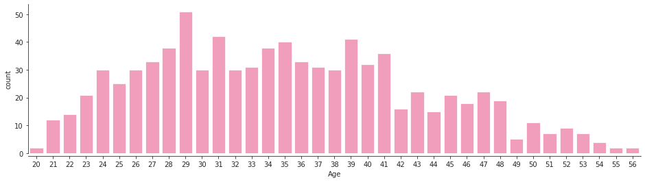
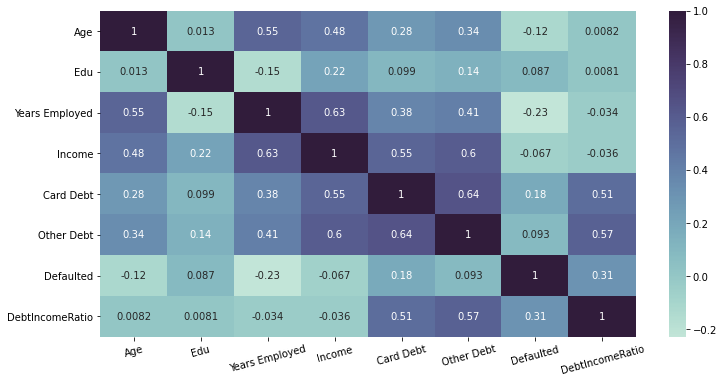
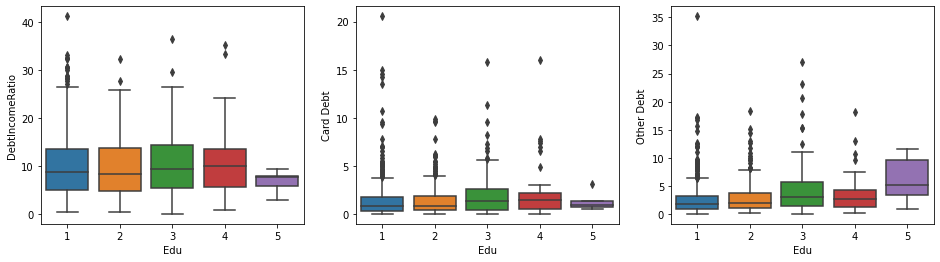
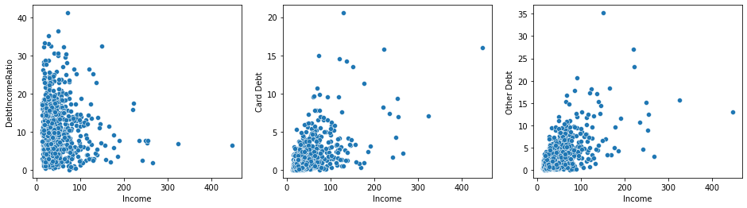
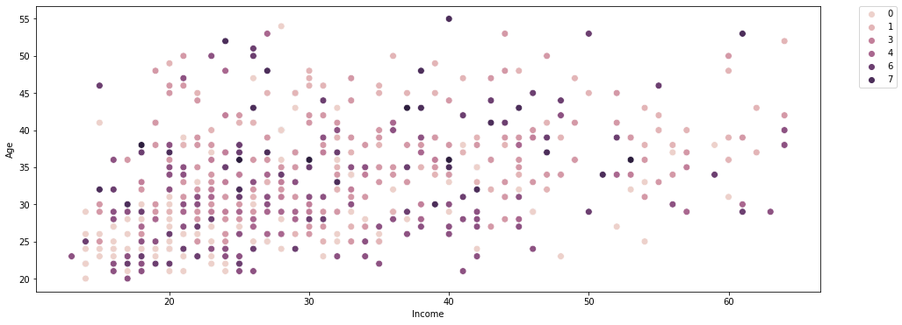
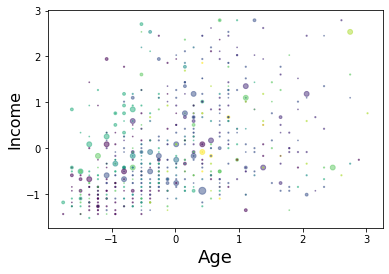
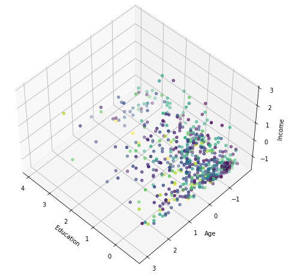
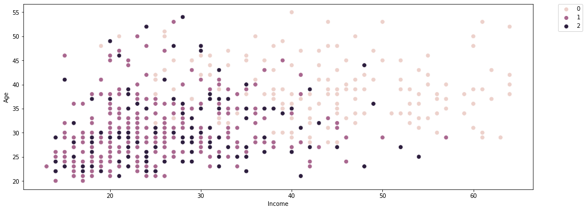
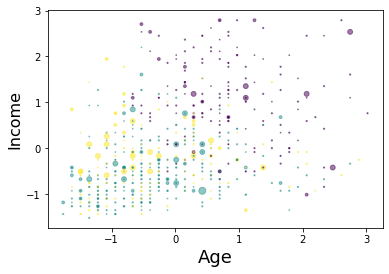
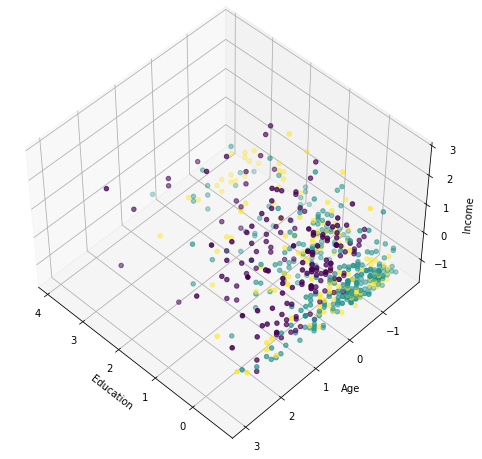

# customer-segmentation

Knowing your customers is very essential in business because once you know your customers you can create schemes and products as per their needs and your profit interest.

Here [Customer Segmentation](https://www.kaggle.com/nafemuhtasim/customer-segmentation) dataset by [Nafe Muhtasim](https://www.kaggle.com/nafemuhtasim) to `cluster` customers in different `segments`. This is `unsupervised` learning problem.

## Table of contents

- [Getting started](#getting-started)
- [Findings](#findings)
- [Clusters](#clusters)
- [License](#license)

## Getting started

The [notebook](https://www.kaggle.com/akashsdas/customer-segmentation) is available on Kaggle to work in the same environment where this notebook was created i.e. use the same version packages used, etc...

## Findings

**Customer age distribution**

> Though the plot might show that there is strong relation between `Age` & `Years Employeed` but that is just because Years Employeed data is very much spreaded. Their `pearson` correlation is 0.55 indicating they have moderate corr
>
> `Age` and `Income` have moderate correlation
>
> `Edu` is have a very low correlation with other columns in the dataset.
>
> `Years Employed` has a moderate correlation between `Age`, `Income` & `Other Debt`
>
> `Other Debt` & `Card Debt` also have moderate correlation with `Income` & `DebtIncomeRation` (as the name suggest that its Debt and Income's ration. Also `Other Debt` & `Card Debt` have a moderate correlation with themselves
>
> `Defauled` has low but only worth while correlation with `DebtIncomeRation`|

**Debt vs EDU**

**Debt vs Income**

To know more read the [notebook](./notebook.ipynb).

## Clusters

**9 clusters**

**3 clusters**

## License

[APACHE LICENSE, VERSION 2.0](./LICENSE)
